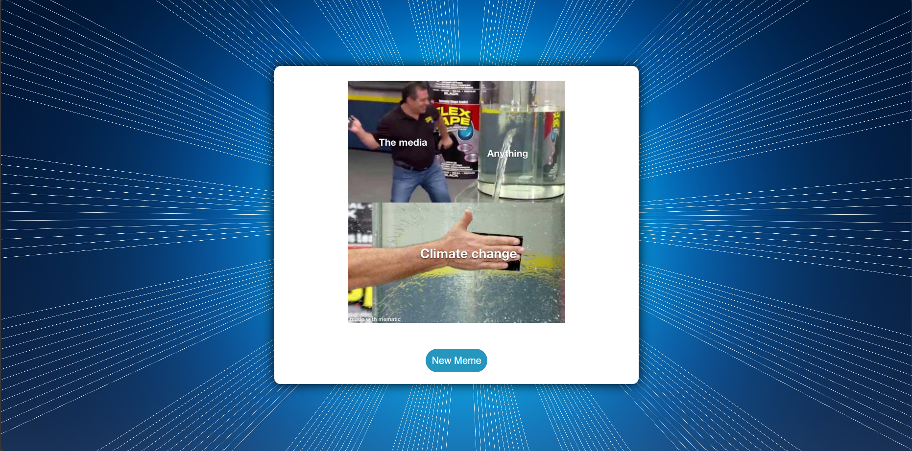

# Meme Generator

Welcome to the Meme Generator project! This simple web application allows you to generate random memes with just a click of a button.

## Table of Contents

- [Demo](#demo)
- [Features](#features)
- [Tech Stack](#tech-stack)
- [Installation](#installation)
- [Usage](#usage)
- [License](#license)

## Demo

You can try out the Meme Generator live [here](https://jain-rithik.github.io/Meme-Generator/).

You can see a screenshot of the project below:

[]

## Features

- **Random Memes**: Get a dose of humor with a new random meme each time you click the "New Meme" button.

## Tech Stack

- **Frontend**: HTML, CSS for the user interface.
- **Backend**: Axios for making API requests to fetch memes.
- **API**: Utilizes the [Meme API](https://meme-api.com/) to get random memes.

## Installation

1. Clone this repository to your local machine using `git clone`.
2. Navigate to the project directory.

## Usage

1. Open the `index.html` file in your web browser.
2. Click the "New Meme" button to fetch and display a random meme.
